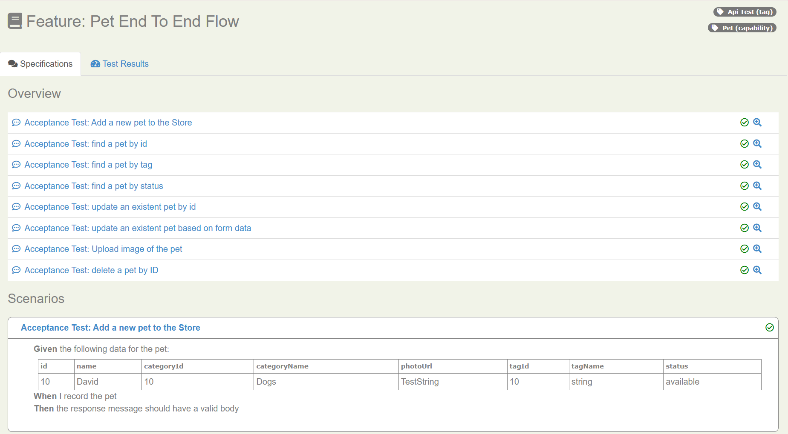
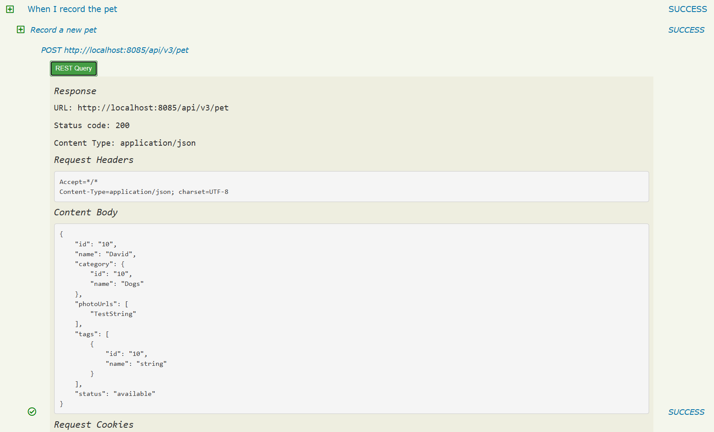

# PetStore with REST API testing with Serenity and Cucumber 6

This framework was builded following the template serenity-rest-starter created by Wakaleo, after that the project was redefined in architecture trying to reach a ScreenPlay pattern

### The project directory structure
The project has build scripts for both Maven and Gradle, and follows the next architecture
```Gherkin
src
  + main
    +java                                 User layer, tasks and interactions
      + exceptions
      + services
      + templates                         Tasks for request creation                       
      + utils
  + test
    + java                                Test runners and supporting code
      +runners
      +stepDefinitions
      + resources
        + features                          Feature files
          + pet
              pet.feature
          + store
          + user
        + images
        + schemas
        + templates                         Freemarker templates and properties files
  

```
## Post scenario

The first kind of scenario for creating a Pet, in addition all the scenarios includes a tag `@ApiTest` this with the objective of running the scenarios by tag filtering

```gherkin
Feature: Feature: Pet End to End flow
  
  @ApiTest
  Scenario: Add a new pet to the Store
    Given the following data for the pet:
      | id | name  | categoryId | categoryName | photoUrl   | tagId | tagName | status    |
      | 10 | David | 10         | Dogs         | TestString | 10    | string  | available |
    When I record the pet
    Then the response message should have a valid body
```

The _Given_ step uses a Freemarker template to merge the data in the Cucumber table with values defined 
in a properties file `standard-pet.properties`- to see how this works in detail, have a look at the `MergeFrom` class.

```java
    @Given("the following data for the pet:")
public void setDataPet(List<Map<String, String>> petDetails) throws IOException {


    pet = MergeFrom.template("templates/petCreate.json")
            .withDefaultValuesFrom(FieldValues.in("templates/standard-pet.properties"))
            .withFieldsFrom(petDetails.get(0));

}
```

Once the message to be posted has been prepared, we use another action class (`petCrudSystem`) to perform the post:

```java
     @Steps
    RecordNewPet recordNewPet;

    @When("I record the pet")
    public void recordPet() {
       recordNewPet.withDetails(pet);
    }
```

The `RecordNewPet` class is responsible for posting this query to the end point, as shown below:

```java
public class RecordNewPet {

    @Step("Record a new pet")
    public void withDetails(String pet) {
        SerenityRest.given()
                .baseUri(Constants.BASE_URL)
                .contentType(ContentType.JSON)
                .body(pet)
                .when()
                .post(WebServiceEndPoints.PET.getPath());
    }
}
```
The last step checks that the response provided gives a valid body, the validation is done with a
JSON SCHEMA matches class that performs a comparison between the response
```java
    @Then("the response message should have a valid body")
public void validateResponse() {
    restAssuredThat(response -> response.statusCode(200));
    SerenityRest.restAssuredThat(response -> response.body(matchesJsonSchemaInClasspath("schemas/pet-schema.json")));

}
```
This is the JSON SCHEMA structure for the comparison located in `schemas` folder

```json
{
  "$schema": "http://json-schema.org/draft-04/schema#",
  "type": "object",
  "properties": {
    "id": {
      "type": "integer"
    },
    "category": {
      "type": "object",
      "properties": {
        "id": {
          "type": "integer"
        },
        "name": {
          "type": "string"
        }
      },
      "required": [
        "id",
        "name"
      ]
    },
    "name": {
      "type": "string"
    },
    "photoUrls": {
      "type": "array",
      "items": [
        {
          "type": "string"
        }
      ]
    },
    "tags": {
      "type": "array",
      "items": [
        {
          "type": "object",
          "properties": {
            "id": {
              "type": "integer"
            },
            "name": {
              "type": "string"
            }
          },
          "required": [
            "id",
            "name"
          ]
        }
      ]
    },
    "status": {
      "type": "string"
    }
  },
  "required": [
    "id",
    "category",
    "name",
    "photoUrls",
    "tags",
    "status"
  ]
}
```

## Get scenario
The project comes with two kind of scenarios fo getting the data `/pet/{petId}` which queries with the id url and the other type of scenario 
is `/pet/findByStatus?status=` which takes query parameters for providing the data 

```Gherkin
  @ApiTest
  Scenario: find a pet by id
  Given the following data for searching the pet:
    | id |
    | 10 |
  Then the response message should have a valid body for the query
```
The implementation follows a similar approach for getting the id and when it finds the data the validation is also with a JSON SCHEMA

## PUT scenario

This scenario follows the same Get approach for creating the data, but it validates the response 
in a different way, the objective is to validate that the changes performed were applied 

```gherkin
  @ApiTest
  Scenario: update an existent pet based on form data
  Given I update the the pet with edition on form data:
    | id | name   | status    |
    | 10 | Juanes | available |
  Then the response should include the following details:
    | id | name   | status    |
    | 10 | Juanes | available |
```

The  step checks that the changes has been implemented correctly in the Pet chosen.

```java
    @Steps
    TradeResponse theTradeDetails;

@Then("the response should include the following details:")
public void the_response_should_include_the_following_details(List<Map<String, String>> petDetails) throws IOException{
    petExpected = MergeFrom.template("templates/petCreate.json")
            .withDefaultValuesFrom(FieldValues.in("templates/standard-pet.properties"))
            .withFieldsFrom(petDetails.get(0));

    restAssuredThat(response -> response.statusCode(200));

    Map<String, String> expectedResponse = recordPetResponse.returned();
    Map<String, String> actualResponse  = recordPetResponse.fromJson(petExpected);

    ResponseValidator.assertResponseContains(actualResponse, expectedResponse);

}
```

The `RecordPetResponse` class is responsible for retrieving the data response and converting it to a map of strings.
```java
public class RecordPetResponse {

    private final ObjectMapper mapper = new ObjectMapper();

    public Map<String, String> returned() {
        return mapOfStringsFrom(SerenityRest.lastResponse().getBody().as(Map.class));
    }

    private Map<String, String> mapOfStringsFrom(Map<String, Object> map) {
        return map.entrySet()
                .stream()
                .collect(Collectors.toMap(
                        Map.Entry::getKey,
                        entry -> String.valueOf(entry.getValue())
                ));
    }

    public Map<String, String> fromJson(String json) throws IOException {
        Map<String, Object> rawMap = mapper.readValue(json, new TypeReference<Map<String, Object>>() {});
        return mapOfStringsFrom(rawMap);
    }
}
```

## Living documentation

It is possible to generate full Serenity reports by running `mvn clean verify` or `./gradlew clean test`. 
This includes both the living documentation from the feature files:



And also details of the REST requests and responses that were executed during the test:



